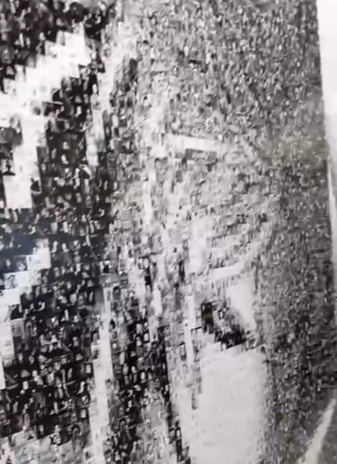

# PicMix
## _**Программа для создания мозаики из картинок по изначальной картике**_

# Предварительная спецификация архитектуры:
## Проблема: 
#### Нужен способ составления мозаичных картинок из других картинок. 

## Функциональные требования:
1. составлять картинку из картинок 
2. урезать все картинки до самой маленькой (не учитывать потерю данных)

## 1. Организация программы представлена в файле arc.drawio проекта.
## 2. Основные классы представлены в файле arc.drawio проекта.
## 3. Организация данных:
#### Все картинки будут представлены в виде массива NumPy.
## 4. Пользовательский интерфейс: 
#### Будет использоваться CLI.
## 5. Управление ресурсами: 
#### Желательно производить действия, без загрузки всех файлов в оперативную память.
## 6. Ввод-Вывод:
#### _Вызов из терминала:_
* argv[1] – путь до оригинальной картинки формата png.
* argv[2] – путь до папки с картинками-составляющими мозаики формата png.
## 7. Обработка ошибок: 
* Простое обнаружение ошибок без корректировки данных.
* Активное обнаружение ошибок.
* Уведомлять пользователя об ошибке.
#### Список ошибок
_…добавить…_
* Передавать ошибку по цепи вызовов.
* Отдельный класс для проверки ошибок.
## 8. Отказоустойчивость:
#### Просто завершать выполнение программы при обнаружении ошибки, с выводом ошибки пользователю.

## _Основной алгоритм работы программы:_
1. Считать все картинки-составляющие.
    
2. #### Работа класса MosaicHarvesting
   #### _mosaic_by_optimal_size():_
   2.1. Найти оптимальный размер картинки-составляющей (минимальная ширина и длинна из всех картинок). 
   
   2.2. Обрезать все картинки-составляющие до оптимального размера.
   
   2.3. Составлять массив средних цветов каждой картинки-составляющей.

   2.4. Разбить основную картинку на части по оптимальному размеру.

   2.5. Брать средний цвет от каждой части и вставлять наиболее подходящую картинку-составляющую.
   
  3. Вывести получившуюся картинку.

